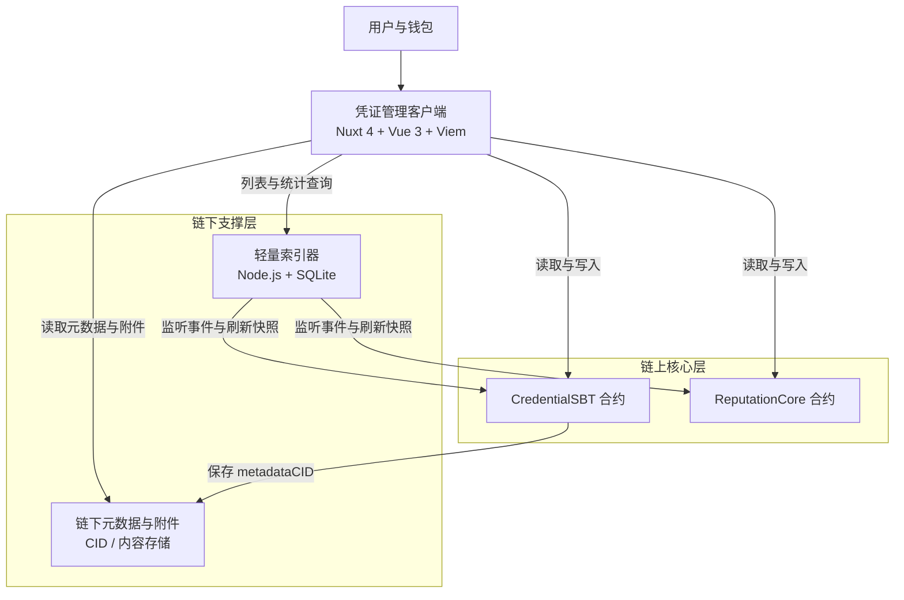

# 本科毕业论文

## 研究背景

数字化社会的发展推动了凭证形态的变革。学历证明、资格证书、机构授权书、电子票据及医疗记录等传统材料逐渐从纸质载体转向电子化形式。电子凭证便于存储、传输与检索，但凭证是否可独立验证、凭证状态是否可追溯，仍取决于其底层系统的数据管理方式。

传统电子凭证系统通常采用中心化架构，由平台服务器负责保存凭证文件、维护用户身份并提供查询入口。该方式实现成本较低，业务流程相对成熟，但凭证状态完全由平台单方维护，验证方只能依赖平台返回的结果。这种模式适合由确定性机构颁发的证书，如学历证明等。但对于需要社区共识或多中心参与的凭证，例如优秀学生称号或餐厅质量评级，引入单一中心化机构并不适宜。这类凭证的可信度应来自社区共识和声誉，而非某个中心化机构的背书([ScienceDirect 2023](https://www.sciencedirect.com/science/article/pii/S2468696423000241); [ScienceDirect 2005](https://www.sciencedirect.com/science/article/abs/pii/S0167923605000849))。

区块链技术源于数字加密货币的应用，是一种分布式数据库技术，具备去中心化、不可篡改、分布式共识与可追溯等特性，能够在不可信环境下实现可靠的数据管理([NIST Blockchain Technology Overview](https://www.nist.gov/publications/blockchain-technology-overview))。这些特性使区块链非常适合用于存储凭证编号、持有人信息、摘要及状态变更等关键信息，利用分布式账本，任何参与者都可以验证网络上的数据，而无法私自篡改。

在以太坊区块链中维护世界状态需要大量计算与存储资源，智能合约必须严格控制时空复杂度。现代去中心化应用通常将链上与链下分布式文件系统结合，以缓解链上存储负担及高额 GAS 成本([DOI:10.3390/fi18020092](https://doi.org/10.3390/fi18020092))，链上仅需存储文件哈希等元数据即可确保链下数据未被篡改。同时，链下索引器可以避免频繁遍历链上数据，进一步减轻计算成本（[A general framework for blockchain analytics](https://arxiv.org/abs/1707.01021)，[Applying the ETL Process to Blockchain Data: Prospect and Findings](https://www.mdpi.com/2078-2489/11/4/204)）。

基于上述背景，本文围绕数字凭证系统的链上核心逻辑开展研究。系统整体包括前端交互、共识声誉、分布式文件存储、凭证展示及其他辅助模块，但本文重点关注共识声誉以及系统架构，主要解决凭证在链上的存储设计、共识声誉的计算、可信凭证的存储和展示等。

### 研究目的与意义

#### 研究目的

本文面向去中心化或多中心协同的社区场景，设计并实现一套基于区块链的社区共识型数字凭证系统。与由单一权威机构直接签发并维护真值的传统电子证书不同，这类凭证用于表达某个主体在社区中的持续贡献、参与经历、协作记录或群体认可，其可信性并不完全来源于单一机构背书，而更多依赖于多方成员围绕同一对象形成的共识判断。因此，本文希望解决的问题并不是如何把已有中心化证书简单搬到链上，而是在开放环境中构建一套能够承载社区评价、限制恶意操作、保留状态历史并支持公开验证的凭证表达机制。

围绕这一目标，本文进一步聚焦于三个相互关联的问题。首先是链上凭证对象的可验证定义，需要使其具备唯一标识、明确归属和不可转移特征，同时支持吊销、展示与检索等生命周期操作。其次是面向社区共识的评价机制，使账户能够基于既有声誉对凭证投票，并在此基础上形成可累计、可更新、可解释的账户声誉。最后是在不显著增加链上存储与读取负担的前提下，通过链下元数据存储、轻量索引与前端聚合展示构建完整的可用系统。

#### 研究意义

本文的研究意义主要体现在两个方面。第一是对数字凭证问题边界的扩展。现有数字凭证研究与工程实践中，相当一部分工作默认凭证的真实性与有效性由单一中心化主体给出，系统设计的重点因而更多放在防伪、上链存证或跨机构验证等方面。然而，在大量社区型协作场景中，凭证的形成过程本身就带有明显的分布式特征，评价权往往分散在多个成员、多个组织或多个利益相关方之间。若仍然沿用单中心签发范式，则很难准确表达这类凭证所依赖的社会共识结构。本文从社区共识型凭证出发，将灵魂绑定代币、链上投票与账户声誉计算结合起来，有助于丰富数字凭证系统的研究对象和建模视角，也为去中心化身份、社区治理和链上声誉之间的结合提供一个可落地的系统原型。

第二是工程实现与应用探索层面。本文给出了一种"链上最小可信状态 + 链下内容组织 + 链下索引查询"的分层实现路径，说明在以太坊这类通用区块链环境下，社区型凭证系统可以不依赖复杂中心化后端而完成铸造、展示、投票、吊销与检索等关键流程，这对类似的 Web3 社区、开源协作组织或多主体评价平台具有一定参考价值。本文引入基于既有声誉加权的投票逻辑，使凭证评价不再是彼此孤立的单次行为，而是与账户历史贡献形成反馈关系，从而为后续进一步研究抗女巫攻击、共识稳健性、链上治理激励与社区信誉积累机制提供了实验基础。因而，本文不仅关注一个具体应用系统的实现，更希望通过该系统验证一种面向开放协作网络的可信凭证组织方式，为去中心化社区中的身份表达与分布式共识信誉机制提供可讨论、可扩展的技术方案。

### 国内外研究现状

区块链在数字凭证存储领域的研究最初多围绕学术证书、学分记录与电子档案展开，其基本思路是在不依赖单一数据库的前提下，用分布式账本保存凭证的关键状态，以提升防伪能力和跨主体验证效率。Turkanović 等提出的 EduCTX 平台较早将区块链用于高等教育学分记录与验证，说明凭证类信息可以借助链上账户、交易与标准化结构进行组织和共享（DOI: [10.1109/ACCESS.2018.2789929](https://doi.org/10.1109/ACCESS.2018.2789929)）。此后，相关研究逐步从单一证书核验扩展到更完整的凭证管理流程。Anand Mishra 等提出面向学生凭证共享的隐私保护架构，在 Ethereum 原型中结合链上记录与安全链下存储，以兼顾可验证性、隐私保护和系统扩展能力（DOI: [10.1016/j.ipm.2021.102512](https://doi.org/10.1016/j.ipm.2021.102512)）。近年来，凭证系统的研究又延伸到全球认证、访问控制与跨链流转等问题，例如 PriFoB 将凭证验证与隐私保护结合起来（DOI: [10.1016/j.jnca.2022.103440](https://doi.org/10.1016/j.jnca.2022.103440)），DAVE-CC 则讨论了跨链环境下的凭证管理与验证机制（DOI: [10.1016/j.jisa.2025.104238](https://doi.org/10.1016/j.jisa.2025.104238)）。该方向已经从早期概念验证逐步发展为围绕存储、验证、共享与互操作展开的系统化研究。

从系统实现路径看，现有区块链凭证存储方案普遍采用链上链下协同结构，而较少直接把完整凭证文件写入链上。这是因为凭证正文、附件材料和元数据往往体量较大、结构灵活，若全部进入智能合约状态，将显著增加存储成本并导致状态膨胀。已有研究普遍选择把凭证摘要、索引、所有权或验证状态放在链上，把高容量内容保留在链下存储层，并通过哈希、CID 或引用地址将两者关联起来。上述研究脉络说明，“链上保存最小可信状态，链下保存高表达度内容”已经成为区块链凭证存储系统中的主流架构选择，这一点与本文采用的凭证元数据和附件链下组织方式保持一致。

随着可验证凭证研究的发展，数字凭证系统的关注点又进一步从“如何存储证书”扩展到“如何表达、携带和验证凭证”。Sedlmeir 等指出，数字身份与可验证凭证的重要价值在于使凭证能够脱离中心化数据库独立完成验证，从而提升可携带性与互操作性（DOI: [10.1007/s12599-021-00722-y](https://doi.org/10.1007/s12599-021-00722-y)）。Mazzocca 等的综述也表明，DID 与 VC 已经成为当前数字凭证建模的重要技术背景，但其关注重点主要仍在凭证签发、持有与验证的通用流程（DOI: [10.1109/COMST.2025.3543197](https://doi.org/10.1109/COMST.2025.3543197)）。对本文而言，这类研究提供了数字凭证标准化表达与跨主体验证的理论背景，但本文更关注的是在以太坊环境下实现一套具体可运行的分布式凭证存储系统，因此仅在必要范围内吸收相关思想，而不以构建完整通用身份基础设施为目标。

区块链应用研究也表明，若系统需要具备可用的查询与展示能力，通常还需要配套的链下数据组织机制。Bartoletti 等与 Tonelli 等分别从区块链分析框架和 ETL 处理过程角度指出，链上原始数据往往需要经过抽取、转换和结构化重组后，才能支撑应用侧的聚合查询与统计分析（DOI: [10.1145/3152824.3152831](https://doi.org/10.1145/3152824.3152831), DOI: [10.3390/info11040204](https://doi.org/10.3390/info11040204)）。不过，这类技术更多属于区块链凭证系统的支撑性实现条件，而不是研究主题本身。综合现有国内外工作，区块链凭证存储研究已经在链上确权、防伪验证、链下协同存储和凭证标准化表达等方面积累了较成熟的方案，但针对以太坊公链环境，将不可转移凭证、链下元数据与完整生命周期管理结合到同一系统中的实现仍相对有限。本文的工作正是在这一基础上展开，目标是设计并实现一套以以太坊为核心的分布式凭证存储系统。

### 本文主要工作

本文围绕数字凭证系统中的架构设计、链上设计以及分布式共识机制展开。前端页面、IPFS 接入等作为必要背景出现，正文重点放在设计一套不可篡改的分布式共识链上事务处理机制。主要工作包括：(1) 确定凭证的抽象数据模型，分离需要在链上可信存储的字段与采用分布式文件系统存储的业务字段；(2) 设计链上智能合约的逻辑结构，通过 ERC-721 等标准接口定义凭证代币；(3) 设计分布式共识声誉计算的逻辑方法；(4) 设计链上、索引器以及去中心化应用程序之间的通讯接口。

### 本文组织结构

## 相关概念

本章说明本系统赖以建立的技术基础，为后续总体设计、共识声誉计算和智能合约实现提供必要的概念背景。

区块链这一数据结构的不可篡改等特性使其记录的数据具有独特优势。以太坊在此基础上提供了可信计算能力，而 ERC-721 和 ERC-5192 定义了一种不可转移（灵魂绑定）的非同质化代币，适合作为"凭证"在链上的载体。钱包与去中心化应用程序的协同方式解释了用户如何发起链上交互。分布式文件系统及 IPFS 则为分布式应用提供了对象存储能力。

### 区块链

区块链可以理解为一种由网络中多台计算机共同维护并持续追加更新的公共数据库，其中“区块”表示数据和状态按连续的组存储在一起，“链”则表示每个区块都会以密码学方式引用其父区块，因此后续区块会将历史状态逐层串联起来。系统中的交易请求只有被打包进某个区块并由网络接受后，才会成为全网共享的有效状态变更。由于每个新区块都建立在已有区块之上，且网络节点必须就新区块及整条链达成一致，因此区块链本质上不仅是数据存储结构，也是分布式状态更新机制\cite{yaga2018blockchain}。

区块链依靠节点传播交易与区块信息，通过共识机制决定哪些状态变更能够被写入主链，并利用哈希引用保证历史结构的连续性和校验性。由于区块内数据会影响该区块哈希，而区块哈希又会被后续区块引用，一旦历史数据被修改，后续整段链式引用关系都会失效\cite{yaga2018blockchain}。网络中的节点需要按照统一规则验证交易是否合法、区块是否有效以及状态转换是否正确，这使区块链具备了去中心化、不可篡改、可追溯和分布式共识等关键特征。这里所谓"不可篡改"并不是绝对意义上不可修改，而是指在开放网络中修改已确认历史需要付出极高成本并突破全网一致性约束，因而在工程实践中可以视作高度可信的历史记录\cite{yaga2018blockchain}。

本系统正是围绕这些特性构建可信凭证机制。去中心化特性使凭证状态不依赖单一中心化服务器维护，避免了传统数据库中由平台单方面删改记录的风险。已铸造的凭证、已发生的投票以及已产生的吊销行为都因不可篡改与可追溯特性而保留清晰的历史轨迹，为后续审计与验证提供基础。分布式共识保证所有节点对凭证所有权、凭证有效性和声誉分数的理解保持一致，从而使"这张凭证是否存在""这张凭证是否被吊销""某账户是否已经投过票"等问题都可以通过链上状态得到统一回答。因此，本系统将最关键的身份锚点和评价真值放置在区块链上，而将更适合高表达和高频查询的部分放到链下协同处理。

### 以太坊与智能合约

如果说一般意义上的区块链主要解决“如何在去中心化环境下可靠记录状态”的问题，那么以太坊进一步扩展了这一能力，使链上不仅能够保存账本，还能够执行通用程序\cite{wood2025ethereum}。可以将其理解为“一条嵌入了计算机的区块链”，它是以去中心化、无需许可、抗审查方式构建应用和组织的基础。在这一体系中，所有节点共同维护一台逻辑上的全局计算机，即以太坊虚拟机\cite{wood2025ethereum}。任意参与者都可以通过交易请求这台虚拟机执行某段代码，而其他节点会根据统一规则验证并复现执行结果，从而将代码执行后的状态变化写入区块链。由此，以太坊不再只是保存“谁向谁转账了多少资产”的账本，而是成为能够存储程序、执行程序并记录程序执行结果的去中心化状态机。

以太坊虚拟机是本系统理解智能合约执行过程的核心。EVM 是一个在所有以太坊节点上以安全且一致方式执行代码的去中心化虚拟环境，它定义了区块间状态变化的具体规则。每当用户发起交易，EVM 都会根据旧状态 $S$ 与交易集合 $T$ 计算新的输出状态 $S'$。这种“状态转换函数”视角非常适合解释本系统中的凭证铸造、投票和吊销操作，因为这些行为本质上都不是对某张表的任意改写，而是满足合约规则约束下的状态跃迁。对本系统而言，凭证的拥有关系、凭证是否失效、某账户是否已投票以及某个地址当前的声誉值，都是 EVM 执行智能合约后得到的持久化状态\cite{wood2025ethereum}。

智能合约\cite{wood2025ethereum}可以看作部署在以太坊上的程序对象，本质上是一组驻留在特定链上地址的代码及其状态数据。开发者可以把可复用代码上传到网络，再由用户以不同参数调用执行。本系统中的 `CredentialSBT.sol` 和 `ReputationCore.sol` 正是这种意义上的智能合约：前者负责凭证的唯一标识、不可转移约束和吊销状态，后者负责投票规则、分数更新和账户声誉缓存。为了编写这类合约，系统采用 Solidity\cite{soliditydocs2024} 语言。Solidity 是面向合约的高级语言，目标执行环境是 EVM，支持状态变量、函数、继承、库和复杂类型，因而适合表达本系统中“凭证状态 + 权限控制 + 投票规则”的复合业务逻辑。在工程配置上，本系统使用 Solidity `0.8.27` 版本，并在 Hardhat 中启用优化器与 `cancun` EVM 版本，以获得更稳定的开发、测试与部署体验。

在代币标准层面，以太坊生态通过 ERC 规范为不同类型的链上资产定义了统一接口。ERC-20\cite{eip20} 面向同质化代币，核心特征是同一合约中的每个代币在类型与价值上可互换，因此常用于货币、积分或投票权单位。与之相对，ERC-721\cite{eip721} 面向非同质化代币（NFT），其关键在于每个代币都由唯一的 `tokenId` 标识，并且同一合约中的不同代币可以具有不同含义与不同价值。对于凭证系统而言，单张凭证天然需要唯一标识、独立生命周期以及一对一对应的持有人关系，因此 ERC-721 比 ERC-20 更适合承载“一个链上对象对应一张具体凭证”的语义。本系统并未选择把凭证表示为可互换数量单位，而是让每一张凭证对应一枚独立的链上代币，这一点与传统同质化积分体系有本质区别。

然而，普通 ERC-721 仍然允许代币在账户之间转移，这与凭证通常应当绑定特定身份或经历主体的业务要求并不一致。为此，本系统进一步采用 ERC-5192\cite{eip5192} 作为约束扩展。EIP-5192 将其定义为 EIP-721 的一个最小扩展，用于通过标准接口表达某个 NFT 是否被永久绑定到单一账户。该规范要求合约通过 `locked(tokenId)` 暴露锁定状态，并在代币处于不可转移状态时使相关转移函数回退。将 ERC-721 与 ERC-5192 结合后，链上对象既保留了 NFT 的唯一性和标准接口，又具备了凭证所需的不可转移属性，这正是灵魂绑定代币（SBT）适配凭证场景的根本原因。对本系统而言，学历、志愿服务经历、培训证明或荣誉记录都不应像普通数字藏品那样自由买卖，否则凭证与经历主体的关联性将被破坏，因此 SBT 是比普通 NFT 更合理的选择。

### 钱包与去中心化应用程序

去中心化应用程序通常可以借用传统 Web 应用的前后端分工来理解，但二者并非完全等价。在传统中心化系统中，前端通常负责界面呈现与用户交互，后端负责业务逻辑、数据库访问与权限控制；而在以太坊语境下，dApp 一般由前端界面与链上智能合约共同组成，其中后端代码运行在去中心化 P2P 网络上，而前端则仍然可以使用通用 Web 技术实现。本系统的 Nuxt 前端相当于用户可直接操作的界面层，`CredentialSBT` 与 `ReputationCore` 则承担了"去中心化后端"的角色，而索引器负责补足传统数据库式查询能力，但并不掌握链上真值。

钱包是用户进入这一体系的关键入口。以太坊账户可以由用户控制，也可以作为智能合约部署；对于普通用户而言，真正持有的是控制账户的私钥，而不是脱离链账本独立存在的资产本体。钱包的作用正是管理密钥、展示账户地址、发起签名并向网络广播交易。在本系统中，用户访问凭证管理前端时，需要先通过浏览器钱包连接自己的外部账户；之后，无论是铸造凭证、吊销凭证还是对他人凭证投票，本质上都对应一次由钱包完成签名并由前端提交的链上交易。相较于中心化应用里“账号密码登录后由服务器代为执行操作”的模式，这里的身份控制权由用户本地钱包直接掌握，前端应用无法代替用户擅自提交状态变更。

本系统前端通过 Viem 与浏览器钱包交互，并围绕“连接账户、读取链上状态、发起写操作、等待交易确认”构建了一套面向凭证管理的交互流程。其中 `connectWallet()` 负责建立连接，`getPublicClient()` 负责公共只读访问，`vote()`、`mintCredential()` 与 `revokeCredential()` 负责提交写交易，`waitForTx()` 则用于等待交易回执。由此，钱包不只是一个登录工具，而是本系统中用户身份、交易授权和状态变更意图的统一入口；dApp 也不只是一个普通网页，而是将前端交互、钱包签名与智能合约执行三者串联起来的去中心化应用界面。

### 分布式文件系统

分布式文件系统的核心目标，是让数据存储与数据访问不再依赖单一中心化服务器，而是通过多节点协同完成数据的组织、寻址与分发。与传统 Web 中依赖固定服务器地址定位资源的方式不同，分布式文件系统更强调内容本身的可验证性、位置无关性以及多节点可获取性。这类系统尤其适合承载"容量较大、结构灵活、需要公开校验但不适合全部上链"的数据对象。在区块链应用中，如果把图片、文档、复杂 JSON 元数据等内容全部直接写入链上，成本高昂且会显著增加状态膨胀，因此通常需要借助链下内容存储机制。

IPFS 是这类机制中最常见的代表。它可以理解为一组用于在 Web 上进行寻址、路由和数据传输的开放协议，其底层建立在内容寻址与点对点网络思想之上。与 URL 更多描述"数据位于何处"不同，IPFS 更强调"数据是什么"。在 IPFS 中，内容标识符 CID 用来指向某份材料，它并不直接描述数据存放的物理位置，而是基于内容本身的密码学哈希形成地址。只要内容发生变化，CID 就会变化；若内容完全相同，则在相同设置下生成的 CID 也将保持一致。因此，CID 同时具有定位与校验双重意义，非常适合与区块链配合使用。

本系统正是利用了 IPFS 式内容寻址的这一特点。系统并不把凭证标题、描述、签发方、自定义业务字段、附件列表乃至图片文件本体直接写入智能合约，而是将其组织成链下元数据文档与附件对象，再把这些内容对应的 `metadataCID` 写入链上。这样做的好处在于，链上只需要保存最关键的最小锚点，既控制了交易成本，也保留了业务表达的灵活性；同时，由于前端读取到的元数据是通过 CID 定位的，系统仍然可以判断链下内容是否与链上引用保持一致。本系统在原型实现阶段使用浏览器本地存储模拟了 IPFS 式内容寻址与文件获取流程，以验证"附件上传、元数据生成、CID 上链、详情页回读"的完整闭环；而从体系结构上看，这一设计与真实 IPFS 的分工方式是一致的，即由链上保存内容引用，由链下承载高表达度数据。

## 总体设计

本系统总体上采用"链上可信状态 + 链下查询与内容组织 + 前端交互呈现"的三层协同思路。链上部分负责保存凭证身份锚点、凭证有效性与共识声誉真值；链下部分分为两类，一类是用于高频列表查询的轻量索引器，另一类是用于承载业务元数据与附件引用的内容存储层；前端部分则负责钱包连接、表单输入、状态聚合与页面展示。这样的分层并不是简单模仿传统前后端模式，而是围绕区块链系统的两个现实约束展开：链上状态必须保持最小且可验证，避免把高成本、弱结构化的大量数据直接写入智能合约；同时用户又需要类似 Web 应用的可检索、可浏览、可交互体验，因此必须在不破坏链上真值地位的前提下，引入必要的链下协同组件。

系统采用 ERC-721 与 ERC-5192 组合定义凭证对象，前端通过 RPC 访问链上接口。面向用户的 dApp 涉及技术栈选型、页面组织与交互边界设计，而索引器则用于减轻链上查询的负担。

本系统总体架构可概括如下图所示。

### 链上凭证与SBT

本系统的链上部分以以太坊智能合约为核心，开发与测试环境采用 Hardhat，本地链标识为 `1337`，合约语言采用 Solidity `0.8.27`，标准库与权限控制能力主要依赖 OpenZeppelin 合约组件。`CredentialSBT.sol` 与 `ReputationCore.sol` 两个核心模块：前者负责凭证对象本体，后者负责投票与声誉计算。这样的分层使“凭证存在与否、是否可转移、是否已吊销”与“如何评价凭证、如何累计账户声誉”形成清晰边界。

在本系统中，链通过 RPC 接口向应用层提供标准化访问能力。本系统前端通过 Viem 创建公共客户端与钱包客户端，分别承担只读查询与带签名写操作两类职责。其中，`getCredentialDetail()` 使用 `multicall` 聚合读取凭证所有者、业务类型、元数据 CID、是否锁定、是否吊销以及链上评分等多个字段，`mintCredential()`、`vote()` 和 `revokeCredential()` 则把用户在界面中的操作转化为具体合约调用。RPC 是本系统中连接"链上状态机"与"前端页面逻辑"的桥梁，它让凭证管理客户端能够像访问远程服务一样访问智能合约，同时又保留了区块链环境下的签名授权与全网一致性约束。

### 凭证管理客户端

本系统面向用户提供了一个去中心化凭证管理客户端，用于完成钱包连接、凭证铸造、凭证浏览、账户检索、投票和吊销等核心操作。客户端采用 Nuxt 4 与 Vue 3 作为前端框架，使用 TypeScript 提升类型约束能力，使用 Viem 连接链上 RPC 与钱包接口，并通过 Tailwind CSS 组织样式系统。由于系统需要兼顾移动端与桌面端访问体验，同时又希望降低链上交互带来的理解门槛，因此客户端并未单纯追求技术演示，而是把页面结构、状态提示、确认弹窗和信息分组都纳入了统一交互设计之中。

在界面设计方面，本系统显式采用 Material Design 3 作为视觉与组件组织依据。该特征直接体现在前端工程配置上：Tailwind 主题中扩展了以 `--md-sys-color-*` 命名的色彩变量、与 MD3 对应的圆角尺度和排版等级，组件中则大量使用 `surface`、`outline`、`primary-container` 等命名语义组织页面层级。此外，系统还集成了 `@nuxtjs/color-mode` 实现明暗主题切换，并通过 `@vite-pwa/nuxt` 为客户端提供渐进式 Web 应用能力。凭证管理客户端借此保持了 dApp 所需的链上交互能力，也尽量遵循现代 Web 应用对可读性、可达性和响应式布局的要求。

从功能组织上看，客户端并不直接暴露合约原始字段，而是通过 `useChain.ts` 将链上快照、索引器结果和链下元数据聚合为 `ChainCredential` 视图对象，再由页面与组件进行展示。这种做法使前端层不必处理过多底层差异，例如链上只保存 `metadataCID`，而详情页实际需要显示标题、描述、签发方、附件图片和展示分；索引器负责返回列表快照，而页面需要继续按展示信誉排序并补充业务字段。因而，本系统前端本质上承担的是“用户任务编排器”的角色，而非简单的链上字段渲染器。

本系统客户端页面与路由对应关系如表所示。

| 页面名称 | 路由 | 主要用途 |
| --- | --- | --- |
| 欢迎页 | `/welcome` | 作为钱包连接入口，引导用户进入系统 |
| 首页 | `/` | 提供统一搜索入口，可按 Token ID 或账户地址跳转 |
| 我的证书 | `/credentials` | 展示当前钱包持有的全部凭证列表 |
| 凭证详情页 | `/credentials/[:id]` | 展示单张凭证详情，并提供投票、吊销、附件下载等操作 |
| 铸造页 | `/mint` | 填写凭证基本信息、业务字段与佐证材料并发起铸造 |
| 账户详情页 | `/accounts/[:address]` | 展示指定账户的声誉、KYC 状态及其持有凭证列表 |

### 索引器

区块链作为分布式数据结构，在高频遍历与列表查询时要求客户端频繁遍历全链历史事件以重建当前状态，而引入索引器服务则可有效缓解对链的频繁遍历导致的问题。对于本系统而言，用户经常需要执行"查看某账户持有的全部凭证""列出最近更新的凭证""按凭证编号读取快照"等操作，而这类操作如果完全依赖链上逐个探测 `tokenId`，查询成本高且会显著增加前端复杂度。尤其是在本系统没有引入 ERC721Enumerable 的前提下，链上并不直接提供按账户枚举全部凭证的能力，因此需要一个能够根据事件日志重建查询模型的链下组件。基于这一原因，本系统设计了独立运行的轻量索引器，由其负责维护只读数据库和对前端友好的查询接口，而不参与任何交易签名与状态写入。

在技术架构上，索引器采用 Node.js 运行环境与 SQLite 持久化存储。`config.mjs` 负责读取链 RPC 地址、链 ID、合约地址、数据库路径以及同步参数；`db.mjs` 负责建表、更新快照和管理同步状态；`indexer.mjs` 负责监听 `CredentialMinted`、`CredentialRevoked` 和 `Voted` 事件，并在发现受影响的 `tokenId` 后调用 `refreshSnapshots()` 以 `multicall` 方式批量刷新链上真值；`server.mjs` 则负责将数据库中的结果通过 HTTP 接口暴露给前端。为了处理本地链重启这一开发阶段常见情况，索引器还通过 `ensureChainFingerprint()` 检测创世块哈希与链 ID，一旦发现链环境已重建，便清空旧索引并重新同步，避免历史脏数据残留。

索引器只承担“可重建的只读副本”角色。它保存的 `credentials` 表并不是新的业务真值来源，而是由链上事件与链上视图函数共同推导出的查询加速结构。因此，本章只在总体层面强调其必要性与模块划分，而更具体的重建方法、同步流程和复杂度讨论将在后文“凭证的遍历”小节中展开。对于前端而言，索引器的意义在于将原本不适合在链上完成的列表型任务转化为普通 HTTP 查询，从而使客户端能够保持接近 Web 应用的响应方式。

本系统索引器当前对外提供的端点如表所示。

| 请求方法 | 端点 | 主要用途 |
| --- | --- | --- |
| `GET` | `/api/indexer/health` | 返回索引器运行状态、最近同步区块和数据库路径 |
| `GET` | `/api/indexer/credentials` | 返回凭证列表，可按 `owner` 参数过滤 |
| `GET` | `/api/indexer/credentials/:tokenId` | 返回指定凭证的索引快照 |
| `GET` | `/api/indexer/stats` | 返回凭证数量统计，可按 `owner` 参数过滤 |

## 共识声誉的计算

在去中心化凭证系统中，仅仅完成“凭证上链”并不能自动回答凭证是否可信、持有人是否长期稳定地输出高质量凭证、外部观察者应当如何理解不同凭证之间的质量差异等问题。传统中心化平台通常依赖单一机构审核、排序与背书，而在链上场景中，凭证的铸造主体、评价主体与查看主体往往并不重合，因此系统需要一种能够由多方参与、又能被链上规则验证的共识声誉机制。本系统的目标是为每一张凭证建立可被持续更新的去中心化共识可信分数，并据此进一步形成账户层面的累计共识声誉。

基于这一目标，本文从去中心化共识声誉机制的形式化关系出发，依次讨论账户声誉和凭证声誉的计算更新机制、投票行为的作用方式及其对两者的影响。随后交代系统中的约束条件，包括 KYC 限制、不可重复投票、不得为自己的凭证投票等规则，以防止刷票和女巫攻击。最后针对新凭证早期票数过少时简单平均波动大的问题，给出统计校正方法与贝叶斯平滑分数机制。

### 去中心化共识声誉机制

为便于描述，设账户集合为 $\mathcal{A}$，凭证集合为 $\mathcal{T}$。对于任意凭证 $t\in\mathcal{T}$，定义所有者映射 $o(t)\in\mathcal{A}$ 表示该凭证当前所属账户。由于本系统中的凭证以 SBT 的形式存在，凭证一经铸造后不能在普通用户之间转移，因此在多数业务场景下，$o(t)$ 可以被视为稳定映射。令 $s_t$ 表示凭证 $t$ 的链上共识分数，$R_a$ 表示账户 $a$ 的链上共识声誉。这样一来，系统中的基本对象便可以抽象为"账户拥有凭证，账户对凭证投票，凭证分数反过来影响账户声誉"的二部关系结构。

如果从图模型角度观察，本系统可以表示为二部图 $G=(\mathcal{A},\mathcal{T},\mathcal{E})$，其中边集 $\mathcal{E}$ 对应账户对凭证的评价行为。然而，本系统并未采用 PageRank 一类需要全局多轮迭代的图算法，而是采用了更适合链上执行的局部增量模型。这是因为区块链智能合约的计算资源昂贵且单笔交易的 Gas 预算有限，如果每发生一次投票都重新遍历全图或遍历某一账户的全部持有凭证，系统复杂度将随着网络规模增长迅速上升，进而失去可部署性。因此，本系统将声誉计算约束在"单次投票只影响有限状态"的框架下，使得一次投票的状态更新始终局限于目标凭证、投票人投票记录以及目标凭证持有人的声誉缓存。

在这一建模中，凭证是被评价对象，账户是声誉承载对象，投票是触发状态变化的唯一显式动作。与中心化评分系统不同，系统并不预设某个权威机构对全部凭证作统一判断，而是允许通过满足约束条件的账户在链上逐步形成对凭证质量的共识。由于每次投票都留下不可篡改的链上记录，且投票权重又与账户历史声誉相关，故该机制同时具备可追溯性与一定程度的自适应能力。换言之，去中心化共识声誉机制并非简单地将点赞与点踩搬到链上，而是在“可验证评价”和“可计算权重”之间建立了一个能够持续演化的闭环。

### 账户共识声誉

账户共识声誉是对账户历史凭证整体可信程度的概括性刻画。在本系统中，账户初始声誉采取保守初始化方案，即所有账户在未因凭证获得正向评价之前，其链上声誉默认为 $0$。这一策略直接体现在 `ReputationCore.sol` 的 `_reputations` 映射上：映射未写入时默认取零值，因此系统无需额外的初始化事务即可保证新账户以中性状态进入网络。该设计可以有效抑制冷启动阶段凭空放大投票权重的风险，因为账户只有在其所持凭证逐步获得他人支持后，才会积累正声誉。

在形式上，本系统将账户声誉写为

$$
R_a=\sum_{t\in\mathcal{T}_a}\Phi(s_t),
$$

其中 $\mathcal{T}_a=\{t\in\mathcal{T}\mid o(t)=a\}$ 表示账户 $a$ 当前持有的全部凭证集合，$\Phi$ 为凭证分数向账户声誉的贡献函数。系统采用的贡献函数为

$$
\Phi(s)=
\begin{cases}
0, & s\le 0,\\
\min(K\cdot s,\ C_{\Phi}), & s>0.
\end{cases}
$$

在本系统中，参数 $K$ 取值为 $2$，参数 $C_{\Phi}$ 取值为 $200$。该贡献函数具有三个特点：凭证分数非正时不对声誉产生贡献，因此低质量凭证不会自动累积声誉；分数为正时贡献随分数单调增加，正向评价多的凭证能抬升持有人整体信誉；单张凭证的贡献存在上界 $C_{\Phi}$，避免单一高分凭证在账户层面产生不成比例的支配作用。

账户共识声誉在本系统中不仅是展示性指标，更是后续投票权重的输入。本系统对应的权重函数可以写为

$$
w_a=\Gamma(R_a)=
\begin{cases}
1, & R_a\le 0,\\
\min(R_a,\ W_{\max}), & R_a>0,
\end{cases}
$$

在本系统中，参数 $W_{\max}$ 取值为 $50$。这意味着即使一个账户尚未积累正声誉，系统仍赋予其最小投票权重 $1$，以保证新账户具备基础参与能力；而当账户声誉持续增长时，其投票权重也会同步提升，但最高不会超过 $W_{\max}$。因此，账户共识声誉在机制上承担了"双重角色"：它既总结了账户历史上被社会接受的凭证成果，又作为未来评价活动的能力约束，使评价权逐步向历史上更可靠的账户集中。

### 凭证共识声誉

与账户共识声誉相比，凭证共识声誉面向的是单张 SBT 的可信程度。本系统在 `ReputationCore.sol` 中通过 `_scores` 映射维护每张凭证的链上分数，并将其视为投票作用后的核心状态变量。由于 Solidity 中整型映射的默认值为零，因此新铸造凭证在未接受任何评价之前，其初始分数满足 $s_t^{(0)}=0$。这一设定具有明确的语义：新凭证不是先天地被认定为高可信或低可信，而是处于一个等待外部评价的中性位置。

为防止分数无限制增长或下降，系统对凭证分数引入了上下界约束。本系统中，分数下界为 $S_{\min}=-100$，上界为 $S_{\max}=1000$，因此任意时刻都满足

$$
s_t\in[S_{\min},S_{\max}]
$$

在本系统中，$S_{\min}=-100$，$S_{\max}=1000$。这一范围并不直接等同于用户界面中的展示分，而是链上原始状态空间。较宽的上界为高质量凭证保留了累积空间，而较低但有限的下界则允许系统记录持续负向评价的结果，同时避免极端负分无限制传播。

除了 `_scores` 之外，系统还维护了 `_rawVoteSums`、`_weightSums` 和 `_voteCounts` 三组辅助统计量。`_rawVoteSums` 记录未经截断的加权投票增量总和，`_weightSums` 记录全部投票权重之和，`_voteCounts` 记录参与投票的唯一账户数。三者在数值上共同构成了对凭证共识声誉的更完整描述：`_scores` 是截断后的当前状态，适合在链上进行后续差分更新；`_rawVoteSums` 和 `_weightSums` 则保留了更丰富的投票过程信息，便于在链下或前端恢复相对平均支持度；`_voteCounts` 用于衡量共识是否建立在足够多的样本之上。因此，本系统中的“凭证共识声誉”并不是单一字段，而是一组围绕凭证评价形成的状态向量。

### 投票

在本系统中，投票是连接账户声誉与凭证声誉的核心机制。设一次投票事件为 $e=(a,t,v)$，其中 $a$ 为投票账户，$t$ 为目标凭证，$v\in\{-1,+1\}$ 为投票方向，$+1$ 表示支持，$-1$ 表示质疑。当前合约实现仅接受这两个离散值，不引入多级评分，从而使链上计算规则保持简洁且易于验证。投票的直接效果是改变目标凭证的分数，而投票的间接效果则是通过凭证分数变化进一步改变该凭证持有人的账户声誉。

设投票账户 $a$ 的投票权重为 $w_a$，则一次投票对目标凭证分数带来的原始增量为

$$
\Delta s_t=\alpha\cdot w_a\cdot v,
$$

其中本系统的参数 $\alpha$ 取值为 $10$。投票后的新分数并不是简单相加，而是经过截断算子限制在合法区间内，即

$$
s_t'=\Pi_{[S_{\min},S_{\max}]}\left(s_t+\Delta s_t\right)
$$

在代码层面，这一过程由 `ReputationCore.vote()` 中的 `_clamp(oldScore + delta, S_MIN, S_MAX)` 完成。由于投票权重本身取决于投票者的历史声誉，因此同样方向的两次投票在系统中未必产生相同影响，高声誉账户的评价会比初始账户更有力度，但这种力度又始终受 $W_{\max}$ 约束。

投票对账户声誉的影响是通过凭证分数的边际变化传导的。若目标凭证 $t$ 的持有人为 $b=o(t)$，则其声誉变化为

$$
\Delta R_b=\Phi(s_t')-\Phi(s_t),\qquad R_b'=R_b+\Delta R_b。
$$

这一写法具有明确的工程意义。系统不需要在每次投票后重新遍历账户 $b$ 持有的全部凭证并重算总声誉，而只需关注本次投票前后那一张目标凭证的贡献变化。也正因此，`vote()` 方法在更新 `_scores[tokenId]` 的同时，能够以常数次存储操作直接更新 `_reputations[owner]`，并同步更新 `_rawVoteSums[tokenId]`、`_weightSums[tokenId]` 与 `_voteCounts[tokenId]`，发出 `Voted` 事件，为链下索引与展示提供充足的数据基础。

本系统中"投票权重提升"与"目标账户受益"是分离的两个环节。投票权重由投票者自身声誉决定，而声誉增长则归属于目标凭证持有人。因此，一个账户只有通过发布被广泛认可的凭证，才能逐步获得更高的评价能力；仅仅依靠频繁投票而没有被认可的持有凭证，并不会自然提升其投票权。这使得投票行为既是评价动作，也是对历史贡献的一种再分配机制。

### 投票的约束

任何共识声誉机制如果缺少约束，都容易退化为刷票系统。针对这一问题，本系统将约束直接编码在合约的 `ReputationCore.vote()` 方法中，从而保证所有前端入口和外部调用者都必须服从同一套链上规则。

系统要求投票者必须通过 KYC 验证。合约通过 `_kycVerified` 映射记录账户状态，并由具有 `KYC_ADMIN_ROLE` 的管理账户调用 `setKYC()` 完成标记。`vote()` 在执行最开始便检查 `_kycVerified[msg.sender]`，未通过验证的地址将被直接拒绝。这一限制构成了系统的主要防女巫机制，通过提高身份伪造成本来削弱攻击者批量注册地址获得额外投票权的可能性。

投票目标必须是真实存在且处于有效状态的凭证。为此，`vote()` 会先调用 `_sbtContract.exists(tokenId)` 检查目标凭证是否存在，再调用 `_sbtContract.isRevoked(tokenId)` 确认该凭证未被吊销。评价只能作用于系统中已被铸造且当前仍被视为有效的凭证，避免了无效对象参与声誉传播过程。合约还要求 `direction` 只能取 `+1` 或 `-1`，防止调用者绕过预期的离散投票模型随意注入异常参数。

系统还显式禁止账户为自己的凭证投票。`vote()` 在取得目标凭证持有人地址后，会执行 `require(owner != msg.sender)` 检查。该约束防止了持有人直接利用自己已有的投票资格为自身凭证背书，从而破坏评价者与被评价者之间的基本分离。合约还通过 `_hasVoted[tokenId][msg.sender]` 这一二级映射记录某账户是否已经对某张凭证投过票，一旦该值为真，后续再次投票将被拒绝。由此，系统实现了"同一实名账户对同一凭证至多投票一次"的防刷票规则。

凭证本身的 Soulbound 特性也从侧面强化了约束结构。`CredentialSBT.sol` 重写了 ERC721 的 `_update()` 方法，使得当 `from` 和 `to` 同时非零时直接回退，从而禁止普通转移行为。凭证不会因转移而改变其被评价历史的归属关系，账户声誉与其持有凭证之间的映射也因此更加稳定。KYC 限制解决的是身份层面的可信进入问题，存在性与有效性检查解决的是评价对象合法性问题，自投票限制和唯一投票限制解决的是投票行为的操纵问题，而不可转移约束则为整个声誉映射提供了稳定的所有权基础。

### 投票基数偏差与统计校正

虽然链上 `_scores` 可以准确记录投票后的状态变化，但若直接将其作为前端展示分数，会遇到一个典型问题：早期样本量很小的凭证，其数值往往波动剧烈，难以稳定反映真实共识。例如，一张刚刚铸造的凭证在仅获得一次正向投票后，其链上分数就可能出现较大跃迁，而另一张拥有大量投票记录的凭证即便发生一次同方向变化，平均意义上的可信度却未必有如此明显的变动。因此，在展示层直接使用原始链上分数并不合适，系统需要一种能够同时考虑“平均评价方向”和“样本数量”的统计校正方法。

为此，前端在 `useChain.ts` 中没有直接展示 `_scores`，而是先根据 `_rawVoteSums` 与 `_weightSums` 计算一个归一化平均支持度。设某张凭证的累计原始投票和为 $V_t$，累计权重和为 $W_t$，则其归一化均值定义为

$$
\bar{m}_t=
\begin{cases}
\operatorname{clip}\left(\dfrac{V_t}{\alpha W_t},-1,1\right), & W_t>0,\\
0, & W_t=0,
\end{cases}
$$

其中 `clip` 表示截断到区间 $[-1,1]$。由于每一次投票的理论增量形式为 $\alpha\cdot w_a\cdot v$，故用 $\alpha W_t$ 进行归一化可以将加权投票结果还原到一个接近"平均立场"的量纲上。系统再将该均值映射到百分制展示空间，得到基础展示分

$$
S_t^{\text{base}}=\mu_0\cdot(1+\bar{m}_t),
$$

其中 $\mu_0$ 表示展示层的中性基准分。在本系统中，$\mu_0=50$，因此完全中立对应 $50$ 分，完全正向对应 $100$ 分，完全负向对应 $0$ 分。

然而，仅有基础展示分仍然无法消除小样本波动，因此系统进一步引入贝叶斯平滑思想。设展示层先验均值为 $\mu_0$，平滑强度为 $\lambda$，并将参与投票人数 $n_t=\text{voteCount}_t$ 作为观测样本量，于是展示分定义为

$$
\hat{S}_t=\frac{\lambda\mu_0+n_t\cdot S_t^{\text{base}}}{\lambda+n_t}
$$

在本系统中，$\mu_0=50$，$\lambda=12$。该公式的含义很直观：当一张凭证几乎没有投票时，系统更倾向于相信它是"中性可信"的，因此展示分会被拉回到 $\mu_0$ 附近；随着参与投票人数增加，样本信息逐渐压过先验，展示分会逐步逼近由真实投票行为决定的基础展示分。这样一来，系统既保留了早期凭证可被快速评价的能力，又避免了极少数投票带来的展示层过度震荡。

在展示层的最后一步，前端还会将平滑后的展示分映射为五分制星级与自然语言标签。设每一星对应的分值尺度为 $\kappa$，则星级可由展示分按 $\hat{S}_t/\kappa$ 换算得到。在本系统中，$\kappa=20$，因此展示分被换算为 $0$ 至 $5$ 的星级值，并根据阈值区间赋予“信誉极好”“信誉良好”“信誉稳定”“信誉一般”“信誉待观察”等标签。应当强调的是，这一统计校正仅服务于前端认知表达，不改变链上的 `_scores`、`_rawVoteSums`、`_weightSums` 与 `_voteCounts` 真值。换言之，链上负责保存可验证事实，展示层负责将这些事实转化为对普通用户更友好的信誉读数。

## 凭证详细设计与实现

在完成共识声誉机制的理论讨论后，还需要回到凭证本体的实现层面，分析系统如何将现实世界中的“可证明经历”表达为链上可验证、链下可扩展、前端可展示的复合对象。本系统采用“链上最小可信锚定，链下承载丰富业务语义”的设计思路：链上合约负责管理凭证的唯一标识、所有权、吊销状态与声誉相关状态，链下元数据负责存储标题、描述、签发方、自定义字段及佐证材料等高表达性信息，而索引器则承担高频遍历与查询聚合任务。这样既避免了将大体量业务信息直接写入链上的高成本问题，也保证了凭证在关键状态上的可验证性。

围绕这一总体设计，本章首先明确"凭证"这一概念在本系统中由哪些数据组成，以及这些字段如何在链上、链下与前端聚合层分布。随后给出用户从填写表单到完成 SBT 铸造的全过程，特别是元数据组织与链上写入之间的关系。在此基础上讨论凭证遍历问题，链上天然不擅长面向列表的查询，这直接催生了索引器方案。接着介绍凭证吊销的语义与实现方式，说明系统如何将已失效凭证与其历史记录同时保留。最后说明智能合约内部如何完成常数复杂度的声誉更新。

### 凭证数据模型

从业务语义上看，一张“凭证”至少应当能够回答以下几个问题：它证明的是什么事情，由谁签发，签发给谁，何时签发，是否包含可补充说明的业务字段，以及是否附带可供核验的佐证材料。在本系统中，这些面向现实业务语义的内容并未全部直接存储在智能合约中，而是被组织为一份结构化元数据文档。该文档在前端对应 `CredentialMetadataDocument` 类型，包含 `version`、`displayType`、`businessType`、`title`、`description`、`issuer`、`recipient`、`issuedAt`、`fields` 与 `evidence` 等字段。其中，`fields` 用于表达如服务时长、证书编号、项目名称等可定制业务信息，`evidence` 则用于引用图片、文档或其他附件材料。

如果进一步映射到链上，当前合约真正直接保存的业务逻辑字段非常克制。`CredentialSBT` 只在 `_businessTypes` 中保存业务类型，在 `_metadataCIDs` 中保存元数据内容标识，在 `_revoked` 中保存吊销状态，并通过 ERC721 继承体系隐式保存 `tokenId` 与 `owner` 关系。这样的设计表明，合约并不试图复刻完整凭证正文，而是仅保存定位链下内容与校验凭证状态所必需的最小闭环。对于区块链系统而言，这是一种更加经济且更符合工程现实的做法：链上状态保持紧凑，易于审计和更新；同时只要元数据内容标识不变，链下文档的完整性就可以通过内容寻址方式得到保障。

除业务语义字段之外，一张可用的凭证 SBT 还必须具备一组"非业务逻辑字段"。这些字段并非现实世界证书概念天然要求，却是智能合约可运行、可验证、可交互所必需的。ERC721 语义要求凭证具有唯一 `tokenId`、所有者 `owner` 以及可查询的 `tokenURI`。ERC5192 语义要求凭证能够声明自身为不可转移状态，因此系统通过 `locked(tokenId)` 固定返回 `true` 并在铸造时发出 `Locked` 事件。为支撑共识声誉机制，凭证还需要关联链上评分 `score`、投票原始和 `rawVoteSum`、权重和 `weightSum`、投票人数 `voteCount` 以及由当前查看者视角得到的 `hasCurrentUserVoted` 等评价状态。因此，本系统中"凭证"的真实数据模型并不是单一结构，而是"链上身份层 + 链上评价层 + 链下业务元数据层 + 前端展示派生层"的组合体。

本系统围绕凭证所采用的真实字段可归纳如下表所示。

| 字段 | 所在层次 | 本系统中的来源 | 作用 |
| --- | --- | --- | --- |
| `tokenId` | 链上身份层 | ERC721 内部编号 | 唯一标识一张凭证 |
| `owner` | 链上身份层 | ERC721 `ownerOf` | 表示凭证持有人 |
| `businessType` | 链上业务锚定层 | `CredentialSBT._businessTypes` | 用于业务分类与检索 |
| `metadataCID` | 链上业务锚定层 | `CredentialSBT._metadataCIDs` | 指向链下元数据内容 |
| `tokenURI` | 链上访问层 | `CredentialSBT.tokenURI()` | 生成 `ipfs://` 风格地址 |
| `isRevoked` | 链上状态层 | `CredentialSBT._revoked` | 表示凭证是否失效 |
| `isLocked` | 链上约束层 | `CredentialSBT.locked()` | 表示凭证不可转移 |
| `score` | 链上评价层 | `ReputationCore._scores` | 表示凭证当前链上分数 |
| `rawVoteSum` | 链上评价层 | `ReputationCore._rawVoteSums` | 保存未截断投票累计值 |
| `weightSum` | 链上评价层 | `ReputationCore._weightSums` | 保存累计投票权重 |
| `voteCount` | 链上评价层 | `ReputationCore._voteCounts` | 保存唯一投票人数 |
| `ownerReputation` | 链上账户层 | `ReputationCore._reputations` | 表示持有人当前账户声誉 |
| `title` | 链下元数据层 | `CredentialMetadataDocument.title` | 表示凭证标题 |
| `description` | 链下元数据层 | `CredentialMetadataDocument.description` | 表示凭证说明 |
| `issuer` | 链下元数据层 | `CredentialMetadataDocument.issuer` | 表示签发主体信息 |
| `recipient` | 链下元数据层 | `CredentialMetadataDocument.recipient` | 表示接收主体信息 |
| `issuedAt` | 链下元数据层 | `CredentialMetadataDocument.issuedAt` | 表示签发时间 |
| `fields` | 链下元数据层 | `CredentialMetadataDocument.fields` | 表示自定义业务字段 |
| `evidence` | 链下元数据层 | `CredentialMetadataDocument.evidence` | 表示佐证材料引用 |
| `displayScore` | 前端展示层 | `useChain.computeDisplayMetrics()` | 表示平滑后的展示分 |
| `displayStars` | 前端展示层 | `useChain.computeDisplayMetrics()` | 表示五分制评分 |
| `displayLabel` | 前端展示层 | `useChain.getDisplayLabel()` | 表示自然语言信誉标签 |

从该表可以看出，本系统对“凭证”的实现采取了分层抽象方法。链上合约负责最关键的身份、状态与评价锚点，链下元数据负责承载高表达度的业务正文，前端再将多源信息聚合为可读性更强的 `ChainCredential` 视图对象。这种结构既满足了 SBT 的标准化约束，又兼顾了真实业务场景对凭证内容表达丰富性的要求。

### 铸造凭证SBT

本系统的凭证铸造流程始于前端页面 `apps/web/pages/mint.vue`。用户在该页面中需要填写标题、签发方、业务类型、描述等基本信息，并可进一步录入任意数量的自定义业务字段以及若干佐证材料。表单中的自定义业务字段以键值对形式组织，每一项都对应 `CredentialBusinessField` 结构；佐证材料则通过文件选择器录入，并在前端根据 MIME 类型区分为图片、文档或一般文件。由此，系统首先完成的是对现实世界凭证信息的结构化整理，而不是立即向链上提交零散字段。

在用户确认铸造后，前端会先处理佐证材料，再生成完整元数据文档。对于每个附件，页面中的 `uploadEvidence()` 方法都会得到其内容标识、类型、文件名、MIME 类型和大小信息，并将这些结果整理为 `CredentialEvidenceReference` 数组。随后，系统构造一份 `CredentialMetadataDocument`，其中写入版本号 `1.0`、展示类型 `certificate`、业务类型 `businessType`、标题 `title`、描述 `description`、签发方信息 `issuer`、接收方信息 `recipient`、签发时间 `issuedAt`、自定义字段 `fields` 以及佐证材料列表 `evidence`。这一步的本质，是将原始表单输入提升为一份可被内容寻址的标准化业务凭证描述。

元数据文档生成后，前端会取得其对应的 `metadataCID`，随后调用 `useChain.mint()` 发起链上铸造。`useChain.mint()` 进一步调用 `useViem.mintCredential()`，后者通过 Viem 的 `writeContract` 方式向 `CredentialSBT` 合约发送 `mintCredential(to, businessType, metadataCID)` 交易。在本系统中，`to` 为当前连接钱包地址，因此凭证铸造人与凭证接收人保持一致。智能合约接收到交易后，会依次检查接收地址非零、业务类型非空、元数据内容标识非空，然后将 `_nextTokenId` 自增得到新的 `tokenId`，调用 `_safeMint(to, tokenId)` 建立 ERC721 所有权关系，并把 `businessType` 与 `metadataCID` 分别写入对应映射。

当链上状态写入完成后，合约会发出 `CredentialMinted(tokenId, to, businessType, metadataCID)` 事件，同时发出 ERC5192 要求的 `Locked(tokenId)` 事件。前者为索引器重建列表状态提供日志依据，后者则表明该凭证从诞生起便处于不可转移状态。合约本身并不存储元数据正文，而是仅通过 `tokenURI(tokenId)` 返回 `ipfs://<metadataCID>` 形式的访问定位符。这说明铸造流程的关键并不在于把所有业务字段塞入链上，而在于通过一次交易把"所有权、业务类型、元数据标识、不可转移约束"这四类可信锚点绑定在一起。

从完整流程来看，凭证铸造并非单纯的 NFT mint 操作，而是一个“业务结构化、内容寻址、链上锚定、标准化输出”连续完成的过程。前端表单负责收集现实语义，链下内容标识负责保持表达能力，SBT 合约负责赋予唯一链上身份，最终三者共同构成一张可验证、可展示、可后续评价的链上凭证。

### 凭证的遍历

凭证遍历问题是 Web3 系统设计中一个典型但容易被忽视的工程难点。虽然 `CredentialSBT` 继承自 ERC721，因此可以通过 `ownerOf(tokenId)` 查询单个凭证的持有人，也可以通过事件日志知道某张凭证何时被铸造，但本系统并未引入 ERC721Enumerable 扩展，因此合约并不直接提供“按账户列出其持有的全部凭证”能力。即便人为在前端从 `tokenId=1` 开始逐个探测，也需要不断尝试、捕获异常并发起大量 RPC 调用，其复杂度会随着系统规模线性增长，既不适合作为列表页的查询方式，也不适合作为声誉系统的高频辅助操作。

正因如此，本系统采用了“链上事件日志重建 + 链下快照查询”的索引器方案。索引器被独立部署在 `apps/indexer` 工作区中，配置项由 `config.mjs` 统一管理，主要包括 RPC 地址、链 ID、两份核心合约地址、Multicall 地址、SQLite 数据库路径、同步分块大小以及定时同步周期。索引器的数据落地由 `db.mjs` 完成，其核心数据表为 `credentials` 和 `sync_state`。前者保存每张凭证的只读快照，包括 `token_id`、`owner`、`business_type`、`metadata_cid`、`revoked`、`score`、`raw_vote_sum`、`weight_sum`、`vote_count`、`minted_at` 与 `updated_at` 等字段；后者保存 `last_synced_block`、`chain_genesis_hash`、`chain_id` 等同步状态，用于索引器恢复与链重建识别。

索引过程的核心逻辑位于 `indexer.mjs` 中的 `syncIndexer()`、`doSync()`、`syncChunk()` 与 `refreshSnapshots()` 等方法。索引器每次同步前会先执行 `ensureChainFingerprint()`，读取创世块哈希和链 ID，并与本地 `sync_state` 中保存的值比较。如果发现本地 Hardhat 链被重启导致创世块发生变化，索引器就会调用 `clearIndexerState()` 清空旧数据，避免旧链的快照污染新链环境。随后，`doSync()` 依据 `getLastSyncedBlock()` 取得上次同步位置，并以设定的分块大小从下一个区块开始增量拉取日志。

在每个区块区间内，`syncChunk()` 会并行读取三类事件日志，即 `CredentialMinted`、`CredentialRevoked` 和 `Voted`。对铸造事件而言，索引器可以直接从日志获得 `tokenId`、接收人地址、业务类型和元数据 CID，因此它会立即调用 `upsertCredentialSnapshot()` 写入一份初始快照，并记录铸造时间和铸造区块。对吊销事件而言，索引器会调用 `markCredentialRevoked()` 先把本地状态标记为已吊销。对投票事件而言，由于日志中只包含新的分数和声誉增量，而列表页需要的是一整套凭证快照，因此索引器不会只依赖事件字段，而是把被这些事件影响到的全部 `tokenId` 收集到一个集合中。

收集完受影响凭证后，索引器会调用 `refreshSnapshots()` 进行快照修正。该方法借助 Viem 的 `multicall` 一次性读取 `ownerOf`、`businessType`、`metadataCID`、`isRevoked`、`getScore`、`getRawVoteSum`、`getWeightSum` 和 `getVoteCount` 八个链上视图函数，从而在同一区块高度获得目标凭证的一致性快照。然后，索引器将这些结果与数据库中已有记录对比并调用 `upsertCredentialSnapshot()` 执行更新。这样设计的优点在于，日志只承担“发现哪些 token 发生了变化”的职责，而最终持久化状态始终以链上读取到的真值为准，从而降低事件字段变化或局部写入遗漏带来的风险。

在对外服务层，`server.mjs` 通过原生 HTTP 服务器暴露了 `/api/indexer/health`、`/api/indexer/credentials`、`/api/indexer/credentials/:tokenId` 和 `/api/indexer/stats` 四类接口。服务器在处理每一个请求前都会先执行 `syncIndexer()`，并在后台通过 `startIndexerScheduler()` 周期性触发同步任务，因此索引结果始终保持与链上较小延迟的最终一致性。前端列表页 `pages/credentials/index.vue` 与账户详情页在查询时不再依赖链上枚举，而是调用 `useChain.getCredentials()`，由其进一步访问索引器接口获取凭证列表，再结合元数据补全标题、描述与附件等业务信息。这样一来，链上复杂度问题被限制在单个凭证真值读取与单次交易执行上，而高频列表检索则转移到了更适合承担遍历任务的链下索引层。

为了便于后续章节引用，当前索引器中与凭证遍历最相关的主要方法符号可整理如下表。

| 方法或符号 | 所在文件 | 作用 |
| --- | --- | --- |
| `ensureChainFingerprint()` | `apps/indexer/src/indexer.mjs` | 识别链是否重建，必要时清空旧索引 |
| `syncIndexer()` | `apps/indexer/src/indexer.mjs` | 对外暴露的幂等同步入口 |
| `doSync()` | `apps/indexer/src/indexer.mjs` | 从上次同步点推进到最新区块 |
| `syncChunk(fromBlock, toBlock, timestampCache)` | `apps/indexer/src/indexer.mjs` | 同步一个区块区间内的全部关键事件 |
| `refreshSnapshots(tokenIds, blockNumber, timestampCache)` | `apps/indexer/src/indexer.mjs` | 用 `multicall` 重读受影响凭证的链上快照 |
| `upsertCredentialSnapshot(snapshot)` | `apps/indexer/src/db.mjs` | 将凭证快照写入或更新到 SQLite |
| `markCredentialRevoked(tokenId, updatedAt, updatedBlock)` | `apps/indexer/src/db.mjs` | 将本地索引中的凭证标记为已吊销 |
| `listIndexedCredentials(owner)` | `apps/indexer/src/indexer.mjs` | 按账户或全局返回凭证快照列表 |
| `getIndexedCredential(tokenId)` | `apps/indexer/src/indexer.mjs` | 读取单张凭证的索引记录 |
| `getIndexerStatus()` | `apps/indexer/src/indexer.mjs` | 返回同步区块、链 ID 和数据库路径等运行状态 |

### 凭证的吊销

在现实世界中，凭证并不总是永久有效。某些证书可能因信息错误、资格取消、业务失效或签发方主动撤回而需要被标记为无效。基于这一需求，本系统在 `CredentialSBT.sol` 中实现了显式吊销机制，而不是简单依赖删除或销毁。具体而言，系统通过 `revokeCredential(tokenId)` 方法完成吊销操作。该方法首先确认目标 `tokenId` 对应的凭证确实存在，然后要求调用者必须满足“凭证持有人本人”或“具有 `REVOKER_ROLE` 权限的账户”二者之一，最后检查该凭证此前尚未被吊销。只有全部条件成立时，合约才会将 `_revoked[tokenId]` 置为 `true`，并发出 `CredentialRevoked(tokenId)` 事件。

这一设计反映出本系统对"吊销"语义的理解并不是物理删除，而是状态失效。被吊销的凭证不会从链上消失，其 `tokenId`、`owner`、`businessType` 与 `metadataCID` 仍然可以被查询，`tokenURI` 仍然保持可解析，前端详情页也仍然可以展示其历史信息；区别仅在于，这张凭证被明确标记为不再有效。这种做法保留了凭证历史痕迹，便于系统审计与责任追溯，也使"状态变化"与"对象存在"相分离，避免业务上有效性变化被误解为对象从未存在。

凭证吊销还会进一步影响评价路径。在 `ReputationCore.vote()` 中，合约在执行投票前会调用 `_sbtContract.isRevoked(tokenId)`，若返回真值则立即回退。因此，一旦某张凭证被吊销，后续账户就不能再继续对其提交新的正向或负向评价，凭证的共识状态在此时被冻结。索引器会监听 `CredentialRevoked` 事件，先在本地数据库中调用 `markCredentialRevoked()` 更新吊销标志，再通过 `refreshSnapshots()` 重新拉取该凭证的最新链上状态。前端详情页据此显示"已撤销"状态，并隐藏进一步投票入口。吊销在系统中不仅是一个孤立的状态位修改，而是贯穿合约、索引器与前端三个层面，形成一致的失效语义。

### 为凭证投票

围绕单张凭证的投票流程，从用户视角看始于前端 `VoteButton.vue` 组件中的支持或质疑按钮；从系统实现视角看，则最终收束于 `ReputationCore.sol` 的 `vote(uint256 tokenId, int8 direction)` 方法。当前前端会在用户点击后先弹出确认框，确认通过后调用 `useChain.vote(tokenId, direction)`，再由 `useViem.vote()` 通过钱包客户端向链上发送交易。这样设计使页面层与合约交互保持解耦，真正决定业务规则的依然是智能合约本身，而不是前端按钮是否可见。

在合约内部，`vote()` 的执行可以分为校验、计算、写回与发出事件四个阶段。校验阶段依次检查投票方向是否合法、发送方是否通过 KYC、目标凭证是否存在、目标凭证是否已吊销、当前账户是否已经对该凭证投过票，以及该账户是否正在给自己的凭证投票。计算阶段通过 `ownerOf(tokenId)` 取得目标凭证持有人，通过 `_weightOf(msg.sender)` 计算投票者权重，通过 `ALPHA * int256(weight) * int256(direction)` 计算本次投票对分数的原始增量，再通过 `_clamp()` 将新分数截断在 $[S_{\min},S_{\max}]$ 区间内。接着分别调用 `phi(oldScore)` 与 `phi(newScore)`，用二者差值计算持有人本次应增加或减少的账户声誉。最后把新结果写入 `_rawVoteSums`、`_weightSums`、`_voteCounts`、`_hasVoted`、`_scores` 与 `_reputations` 六类状态，并发出 `Voted` 事件。

如果仅从数学表达上看，账户声誉本应等于其全部凭证贡献之和，那么每发生一次投票后，最直接的办法似乎是重新遍历目标持有人拥有的全部凭证并据此求和。但正如前文在凭证遍历小节中所分析的那样，链上环境并不适合执行这种与持仓规模线性相关的操作。因此，本系统采用了局部缓存更新方法，即把账户总声誉直接缓存在 `_reputations` 中，并在每次投票时仅根据目标凭证分数的前后变化量执行差分更新：

$$
R_b' = R_b + \Phi(s_t') - \Phi(s_t)
$$

在满足“单次投票只影响单张凭证”“凭证所有权在交易期间不变化”“分数与声誉在同一事务中原子提交”这些条件时，上式与全量重算是严格等价的，但其链上复杂度从 $O(|\mathcal{T}_b|)$ 降为 $O(1)$。这也是 `ReputationCore` 在本系统中最关键的工程取舍之一。

此外，本系统对投票统计量的维护还具有额外价值。由于 `_scores` 会受到上下界截断影响，因此它适合作为链上后续状态计算输入，却不总能完整反映投票历史强度。为此，系统额外保存 `_rawVoteSums` 作为未截断的累计投票和，保存 `_weightSums` 作为累计投票权重，保存 `_voteCounts` 作为唯一投票人数。前端的展示分平滑正是基于这些统计量完成的，而索引器也会在监听到 `Voted` 事件后调用 `refreshSnapshots()` 把最新统计值写入本地数据库。由此，围绕一张凭证的投票在系统中同时产生了三类结果：它更新了链上即时分数，它更新了持有人账户声誉，它还沉淀出一组可供查询、排序和统计校正使用的评价历史摘要。

## 可行性分析

从技术可行性看，本系统所依赖的核心技术均已有成熟工具链与工程基础。链上部分采用以太坊智能合约作为可信状态载体，使用 Solidity 编写凭证合约与声誉合约，并通过 Hardhat 完成本地链运行、合约编译、部署和测试。以太坊本身已经提供账户模型、交易签名、事件日志和状态机执行机制，能够满足凭证铸造、状态查询、吊销和投票等操作对可追溯性与一致性的要求。合约层没有把复杂文件正文直接写入链上，而是只保存 `businessType`、`metadataCID`、吊销状态和声誉统计等关键字段，从而避免了链上存储成本过高的问题。前文已经分析，链上最小可信状态与链下内容组织相结合，是区块链凭证系统较为常见的实现路径\cite{zhu2026onchainoffchain}，因此本系统在技术路线选择上具有现实基础。

从系统实现可行性看，本系统采用的模块划分较为清晰，前端、合约、索引器和内容存储之间不存在难以协调的强耦合关系。前端客户端使用 Nuxt、Vue 与 Viem 组织钱包连接、合约调用和页面展示；链上合约只负责处理必须可信执行的状态变更；索引器基于事件日志和 `multicall` 重建只读快照；链下内容存储负责承载元数据文档和附件材料。这种分层方式使每个模块的职责边界相对明确，也便于在开发阶段分别调试。特别是索引器并不取代链上真值，而是根据事件和视图函数生成可重建的查询副本，因此即使索引数据库出现损坏，也可以通过重新同步链上事件恢复状态。这说明系统在工程实现上不仅能够运行，而且具有一定的可维护性。

从经济可行性看，本系统的设计有意控制了链上写入范围。若将凭证标题、描述、附件、图片和自定义字段全部保存到智能合约中，每次铸造都会带来较高 Gas 消耗，并且会使链上状态持续膨胀。相比之下，本系统只在链上保存元数据内容标识和少量状态字段，把高容量内容放在链下存储层，再通过 `metadataCID` 建立引用关系。投票机制也采用常数复杂度的局部更新方法，只修改目标凭证和凭证持有人声誉缓存，而不在链上遍历账户持有的全部凭证。索引器则把列表查询、账户凭证检索和统计查询转移到链下执行，避免前端反复扫描链上状态。由此可见，本系统在功能完整性和链上成本之间进行了较为克制的取舍，具备在测试网络和小规模真实网络中部署验证的经济可行性。

从运行可行性看，本系统所需运行环境可以由通用开发设施支撑。合约部分可以部署在本地 Hardhat 链或兼容以太坊的测试网络中，前端可以通过浏览器钱包完成账户连接和交易签名，链下索引器使用 Node.js 与 SQLite 即可运行，不依赖大型数据库集群。内容存储层采用 Kubo 节点提供 IPFS 内容寻址能力，开发阶段可以禁用默认 bootstrap 节点并使用离线本地节点完成 CID 生成和内容读取，从而在不依赖公网 IPFS 服务的情况下验证“附件上传、元数据生成、CID 上链、详情页回读”的完整流程。前端通过 Nitro 代理访问本地 IPFS API 和网关，也降低了浏览器跨域配置对联调过程的影响。这些条件表明，本系统在本科毕业设计的实验环境中具有较好的可部署性和可复现性。

从数据安全与可信性看，本系统将不同性质的数据放置在不同层次中处理。凭证是否存在、凭证属于谁、凭证是否被吊销、某账户是否已经投票以及链上声誉统计等关键状态由智能合约维护，所有状态变化都需要通过交易执行并留下链上记录。凭证正文和附件材料虽然存放于链下，但其访问入口由内容标识符定位，若内容发生变化，对应标识也会随之改变，因此可以在一定程度上保证链下材料与链上引用之间的一致性。投票部分通过 KYC 标记、禁止自投票、禁止重复投票和吊销后禁止继续投票等规则约束评价行为，降低刷票和无效评价对系统的影响。虽然本系统并未声称完全解决开放网络中的全部身份攻击与隐私保护问题，但对于以原型验证为目标的凭证存储与共识评价系统而言，其核心可信路径是可实现且可解释的。

从扩展可行性看，本系统的结构为后续演进保留了空间。凭证合约与声誉合约分离，使凭证生命周期管理和评价逻辑可以分别调整；元数据采用结构化文档组织，便于增加新的业务字段和附件类型；索引器以事件日志为同步来源，可以在保持链上合约真值不变的前提下扩展更多查询条件；前端展示分采用链下派生计算，不会影响链上原始分数与投票统计。若后续需要接入公开 IPFS 节点、第三方 pinning 服务或更复杂的身份认证机制，也可以主要通过链下服务和前端配置完成扩展，而不必重写凭证对象的基本链上结构。因此，本系统不仅能够满足当前毕业设计范围内的功能验证，也具备继续扩展为更完整分布式凭证平台的基础。

综合上述分析，本系统在技术路线、工程实现、成本控制、运行部署、数据可信和后续扩展等方面均具备可行性。其核心思路并不是把传统电子凭证系统简单迁移到链上，而是在以太坊可信状态、链下内容存储、索引查询和前端交互之间建立分工关系，使凭证能够以较低链上成本获得可验证身份、可追溯状态和可展示内容。对于本科毕业设计而言，该方案的规模适中、边界清晰，既能够覆盖区块链凭证系统的主要技术环节，也能够通过实际代码和本地运行环境完成完整闭环验证。
