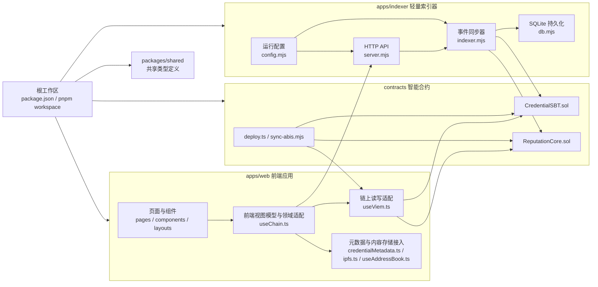

# CredChain 模块设计与总体架构

## 1. 文档目的

本文档用于描述 CredChain 当前代码库的总体模块划分、层次边界、模块职责以及模块之间的依赖关系。该内容适合作为毕业论文中“系统总体设计”与“模块划分”章节的基础材料。

## 2. 系统总体分层

当前系统采用“前端应用 + 轻量索引器 + 链上合约 + 共享类型”的分层结构。系统核心不依赖传统中心化业务后端，而是围绕链上可信状态与链下只读索引展开。

总体上可以分为五层：

1. 用户交互层  
   由 Nuxt 4 前端承担，负责钱包连接、页面渲染、交互控制、表单输入、证书展示与操作触发。

2. 前端领域适配层  
   由 `useChain.ts`、`useViem.ts` 等模块承担，负责把链上数据、索引器数据与业务元数据组合为前端可直接渲染的视图模型。

3. 轻量索引层  
   由独立的 Node.js 索引器承担，监听链上事件、周期性同步状态，并将结果存入 SQLite，以支持前端按账户或凭证查询，而不需要链上全量枚举。

4. 区块链业务层  
   由 `CredentialSBT` 与 `ReputationCore` 两个核心合约构成，分别负责凭证上链与信誉投票计算。

5. 共享模型与内容存储接入层  
   由共享类型定义、前端本地地址簿、本地 Kubo 节点接入组成，用于支撑元数据与附件管理。

## 3. 工作区模块图

## 4. 模块职责总表

| 模块 | 路径 | 核心职责 | 主要输入 | 主要输出 |
| --- | --- | --- | --- | --- |
| 根工作区 | `package.json` | 统一编排前端、索引器、合约的构建、测试、开发命令 | 开发命令、构建命令 | 子项目运行环境 |
| 前端应用 | `apps/web` | 提供用户界面与钱包交互 | 钱包账户、索引器 API、链上状态 | 页面、交易请求、用户反馈 |
| 轻量索引器 | `apps/indexer` | 从链上事件重建只读查询数据库 | 链上事件、链上快照、运行配置 | SQLite 数据库、HTTP 查询接口 |
| 智能合约 | `contracts/contracts` | 定义链上凭证、吊销、投票、信誉计算规则 | 交易调用 | 链上状态、事件日志 |
| 部署与 ABI 同步 | `contracts/scripts` | 部署本地链合约并同步 ABI 到前端 | 本地 Hardhat 节点 | 合约地址、ABI 文件 |
| 共享类型 | `packages/shared` | 提供跨模块可复用的抽象类型 | TypeScript 类型定义 | 共享领域模型 |

## 5. 前端子模块设计

### 5.1 页面层

前端页面对应用户任务场景，主要包括：

- `pages/index.vue`：仪表盘与统一搜索入口
- `pages/credentials/index.vue`：当前钱包持有的证书列表
- `pages/credentials/[id].vue`：单张证书详情、投票、吊销、附件下载
- `pages/accounts/[address].vue`：账户详情与其持有证书列表
- `pages/mint.vue`：铸造证书表单
- `pages/welcome.vue`：钱包连接入口

页面层不直接操作链上原始数据，而是依赖组合式模块返回的视图模型。

### 5.2 领域适配层

前端的核心不是直接读取链上数据，而是将多来源数据合成为统一的前端领域对象。

- `useViem.ts`：只负责底层链上 RPC 读写
- `useChain.ts`：负责把链上状态、索引器结果、元数据文件组装为 `ChainCredential`
- `useAddressBook.ts`：维护浏览器本地地址到友好名称的映射

其中 `useChain.ts` 是前端的核心“应用服务层”。

### 5.3 组件层

组件层承担可复用 UI 结构：

- `PageHeader.vue`：页面标题与返回入口
- `CredentialRow.vue`：证书列表项
- `VoteButton.vue`：投票按钮与确认流程
- `ConfirmDialog.vue`：页面内 MD3 风格确认弹窗
- `EditableAccountName.vue`：账户友好名称编辑
- `SectionBlock.vue`：统一的信息分组容器

组件层只负责表达和交互，不负责业务聚合。

### 5.4 内容存储接入层

当前前端通过独立的内容存储接入模块管理元数据与附件：

- `ipfs.ts`：负责调用本地 Kubo 节点的 RPC API 上传文件与元数据，并通过本地 Gateway 生成可访问地址
- `credentialMetadata.ts`：定义证书元数据结构与附件结构

这使得系统能够以真实 IPFS CID 完成“铸造 - 展示 - 下载附件”的完整闭环。

## 6. 轻量索引器子模块设计

轻量索引器是当前架构中的关键中间层，用于替代链上全量枚举。

### 6.1 配置模块

`apps/indexer/src/config.mjs` 负责定义：

- 索引器主机与端口
- 链 RPC 地址与链 ID
- 合约地址
- SQLite 数据库路径
- 同步分块大小与同步周期

### 6.2 数据持久化模块

`apps/indexer/src/db.mjs` 基于 `node:sqlite` 提供：

- `credentials` 表的建表与更新
- `sync_state` 表的建表与更新
- 单条凭证查询、按账户查询、计数查询
- 最近同步区块号读写

### 6.3 事件同步模块

`apps/indexer/src/indexer.mjs` 是索引器的核心，其职责包括：

- 检测链指纹，避免本地链重置时旧索引污染
- 监听并解析 `CredentialMinted`、`CredentialRevoked`、`Voted`
- 对被影响的 token 执行一次多合约快照刷新
- 将刷新结果持久化到 SQLite

该模块实际上实现了一个“事件驱动 + 快照修正”的轻量索引模式。

### 6.4 API 暴露模块

`apps/indexer/src/server.mjs` 暴露以下查询接口：

- `GET /api/indexer/health`
- `GET /api/indexer/credentials`
- `GET /api/indexer/credentials/:tokenId`
- `GET /api/indexer/stats`

因此，前端列表页和账户页不再需要链上枚举，而是依赖该模块提供的聚合结果。

## 7. 链上合约子模块设计

### 7.1 CredentialSBT 模块

`CredentialSBT.sol` 负责证书本体：

- 以 ERC721 为基础表达“一张证书对应一个 SBT”
- 通过 ERC5192 语义禁止转移
- 维护 `businessType`、`metadataCID` 与 `revoked` 状态
- 提供 `mintCredential`、`revokeCredential`、`isRevoked` 等接口

### 7.2 ReputationCore 模块

`ReputationCore.sol` 负责评价与信誉计算：

- 记录每个 token 的 `score`
- 记录投票累计统计量 `rawVoteSums`、`weightSums`、`voteCounts`
- 记录每个用户是否已对某 token 投票
- 记录账户声誉 `_reputations`
- 维护 KYC 状态
- 提供 `phi` 与投票权重机制

该模块与 `CredentialSBT` 协同，构成“凭证 + 声誉”的链上核心。

## 8. 模块边界与依赖关系

### 8.1 前端与索引器边界

前端不负责重建链上数据库，也不直接维护列表状态索引。  
前端只负责：

- 请求索引器 API 获取列表与统计结果
- 请求链上获取单个 token 的关键真实状态
- 请求元数据与本地 Kubo Gateway 补全业务信息

索引器只负责只读查询，不负责钱包签名和交易发送。

### 8.2 前端与智能合约边界

前端通过 `useViem.ts` 调用链上：

- `vote`
- `mintCredential`
- `revokeCredential`
- 各类 `view` 方法

但所有业务规则以合约校验为准，例如：

- 是否 KYC
- 是否重复投票
- 是否给自己的证书投票
- 是否具备吊销权限

### 8.3 索引器与智能合约边界

索引器不拥有业务真值，只拥有可重建的只读副本。  
真值仍然来自：

- 合约状态
- 合约事件

索引器只将真值转换为更适合前端查询的数据库形式。

## 9. 当前架构特点总结

当前 CredChain 架构具有以下特点：

1. 采用链上可信状态与链下只读索引分离的设计。  
2. 采用“一凭证一 SBT”的链上身份模型。  
3. 采用“业务元数据链下存储、链上只保存 CID”的轻量上链策略。  
4. 采用轻量索引器替代链上枚举，提高了查询效率与结构清晰度。  
5. 前端通过视图模型聚合多源数据，使 UI 层不必直接处理底层合约细节。  

这一设计较适合作为本科毕业论文中的“Web3 凭证系统原型架构”案例，因为其层次清晰，模块边界明确，并且能够完整演示前端、链下索引与链上合约之间的协同关系。
